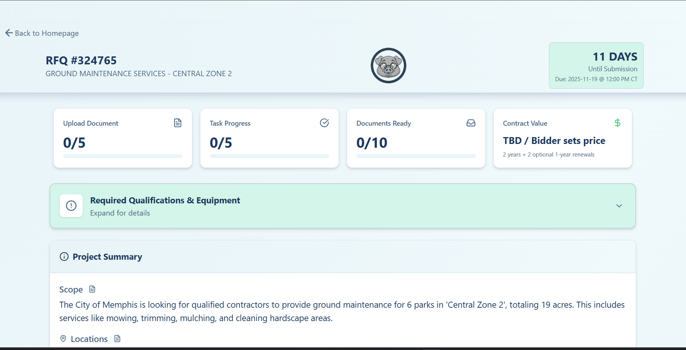

# Memphis BBQ 🐷


**Small Business Owners need clarity in common language, as quickly as possible.**

Memphis BBQ helps small business owners decode complex government procurement documents by using a local AI model (via WebLLM) to extract deadlines, requirements, disqualifiers, and submission checklists into a clear, actionable dashboard.

Save time. Reduce errors. Increase your chances of winning contracts. Try Memphis B.B.Q. today!




---

## Background

This app was created as a solo entry for the [Hack Memphis 2025 Hackathon](https://innovatememphis.com/winning-solutions-and-scenes-from-the-2025-city-hackathon/) under the "Tools for local business partners" category. After a successful demo and pitch, I received the runner-up prize of $500 and generated strong interest from local businesses and the city IT department. I was able to showcase my ability to **recognize a problem**, **gather requirements**, and **translate them into a working solution** in a short amount of time using **AI-assisted development**. I plan to continue development and make it available to the public.

## Features

- **PDF Text Extraction** — Upload any RFP/RFQ PDF and Memphis BBQ extracts the text automatically.
- **Structured Analysis** — Converts bureaucratic jargon into plain-language summaries at a 6th-grade reading level.
- **Interactive Dashboard** — Track tasks, required documents, key dates, and disqualifiers with a visual checklist.
- **Percise Citation** — Memphis BBQ cites the source of the text it extracts from the RFP/RFQ document inline with the analysis.
- **Mobile-friendly** — Memphis BBQ is mobile-friendly and can be used on any device.

---

## Quick Start

### Local Installation

```bash
# Clone the repository
git clone https://github.com/tremckinley/memphis-bbq.git
cd memphis-bbq

# Install dependencies
npm install

# Start the development server
npm run dev
```

Then open [http://localhost:5173](http://localhost:5173) in your browser.

---

## How It Works

1. **Upload** — Drop a PDF of your RFP/RFQ document
2. **Analyze** — LLM parsed the document and returns a JSON object
3. **Insert** — The JSON object is inserted into rfp_data.js
4. **Review** — The structured JSON output populates an interactive dashboard

### What Gets Extracted

| Category | Details |
|----------|---------|
| **Project Info** | RFP number, title, issuing organization |
| **Summary** | Plain-language scope, contract duration & value |
| **Key Dates** | Deadlines for questions, site visits, submissions |
| **Contacts & Addresses** | Who to call, where to submit |
| **Qualifications** | Insurance, equipment, eligibility requirements |
| **Disqualifiers** | Common mistakes that auto-reject bids |
| **Tasks** | Step-by-step checklist before submission |
| **Required Documents** | Forms and attachments you need to include |
| **Scoring Criteria** | How bids are evaluated |
| **Caveats** | Important "gotchas" and fine print |

---

## Tech Stack

| Layer | Technology |
|-------|------------|
| **Framework** | React 19 + Vite 7 |
| **Styling** | Tailwind CSS 4 |
| **Icons** | Lucide React |

---

## Project Structure

```
memphis-bbq/
├── public/                      # Static assets
│   ├── demo_rfp.pdf             # Demo RFP document
│   ├── icon.png                 # App icon
│   └── screenshot.png           # App screenshot
├── src/
│   ├── components/
│   │   ├── Header.tsx           # Dashboard header with navigation
│   │   └── RFPDashboard.tsx     # Interactive results dashboard
│   ├── App.jsx                  # Main app with routing logic
│   ├── App.css                  # Global styles
│   └── main.jsx                 # React entry point
├── server.js                    # Express backend for PDF parsing & OpenAI
├── system_prompt.js             # AI prompt with JSON schema
├── rfp_data.js                  # Sample demo data
├── .env                         # Environment variables (API keys)
└── index.html
```

---

## Configuration

### Full Deployment still under development

This app is currently in development and requires a backend server to run. The full deployment is not yet available.

### Customizing the Analysis Prompt

The extraction schema is defined in `system_prompt.md`. Modify this file to adjust what data gets extracted or change the output format.

---

## Contributing

Contributions are welcome! Please feel free to submit a Pull Request.

1. Fork the repository
2. Create your feature branch (`git checkout -b feature/amazing-feature`)
3. Commit your changes (`git commit -m 'Add amazing feature'`)
4. Push to the branch (`git push origin feature/amazing-feature`)
5. Open a Pull Request

---

## License

This project is **proprietary source-available** software. You may view and study the code, but commercial use requires a license. See the [LICENSE](LICENSE) file for details.

## Contact

For commercial licensing, partnership inquiries, or questions:

- **Email**: [tremckinley901@gmail.com]
- **LinkedIn**: [Tremaine McKinley](https://www.linkedin.com/in/tremaine-mckinley/)
- **GitHub**: [@tremckinley](https://github.com/tremckinley)

---

<p align="center">
  <strong>Built with by a Memphian, for Memphis small businesses impact.</strong>
</p>
